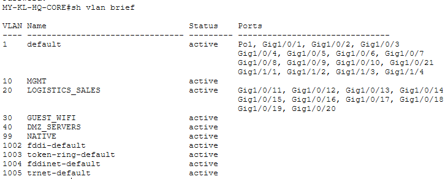
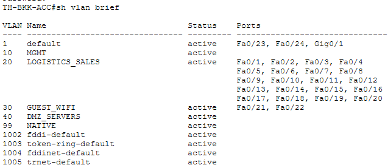
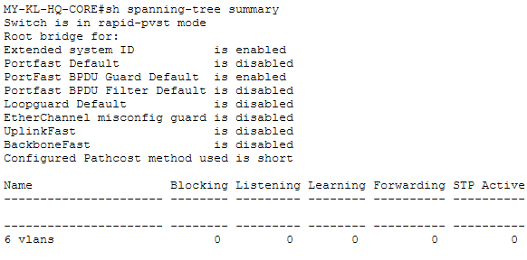
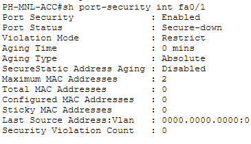
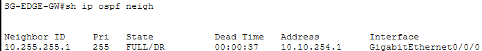
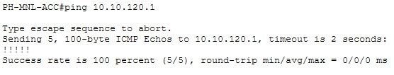
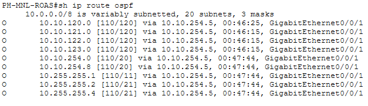
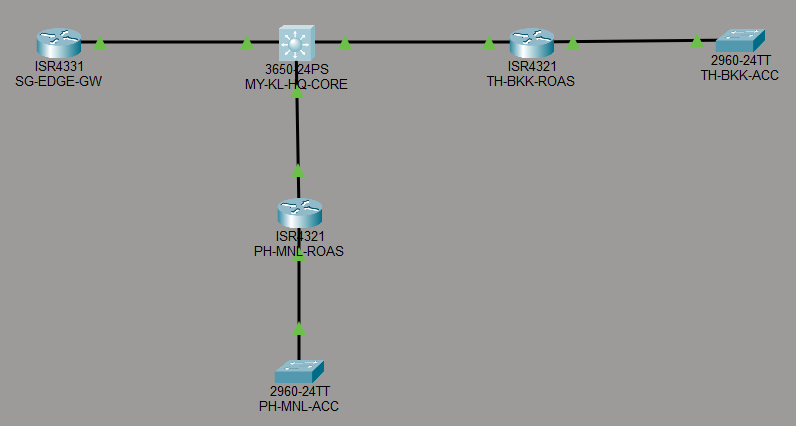

# Phase 1 & 2 — Verification Screenshots

Live `show` command output and topology view from Packet Tracer, captured as evidence that the switching/routing
configs in `../switching/` and `../router-configs/` behave as documented — not just written and assumed correct.
(Converted from the original `screenshots.docx` so it renders directly on GitHub instead of requiring a download.)

## VLANs

**`MY-KL-HQ-CORE# sh vlan brief`**

**`PH-MNL-ACC# sh vlan brief`**

**`TH-BKK-ACC# sh vlan brief`**

## HSRP & Spanning Tree

**`MY-KL-HQ-CORE# sh standby brief`** — all 4 HSRP groups active, no peer (single-core design)

**`MY-KL-HQ-CORE# sh spanning-tree summary`** — rapid-PVST+, PortFast/BPDU Guard enabled

## Trunking

**`PH-MNL-ACC# sh interfaces trunk`**

**`TH-BKK-ACC# sh interfaces trunk`**

## Port Security

**`MY-KL-HQ-CORE# sh port-security int g1/0/11`**

**`PH-MNL-ACC# sh port-security int fa0/1`**

**`TH-BKK-ACC# sh port-security int fa0/1`**

## Management SSH

**`TH-BKK-ACC# ssh -l asean.admin 10.10.110.2`** — cross-site SSH session, TH-BKK-ACC to PH-MNL-ACC

## OSPF Adjacencies

**`MY-KL-HQ-CORE# sh ip ospf neigh`**

**`SG-EDGE-GW# sh ip ospf neigh`**

**`PH-MNL-ROAS# sh ip ospf neigh`**

**`TH-BKK-ROAS# sh ip ospf neigh`**

## End-to-End Reachability

**`PH-MNL-ACC# ping 10.10.120.1`** — 100% success, cross-VLAN via ROAS

**`PH-MNL-ACC# ping 10.10.110.1`** — 100% success

## OSPF Routing Table

**`PH-MNL-ROAS# sh ip route ospf`**

**`TH-BKK-ROAS# sh ip route ospf`**

## IPv6 Dual-Stack

**`PH-MNL-ROAS# sh ipv6 int brief`**

**`TH-BKK-ROAS# sh ipv6 int brief`**

## Topology Overview

Full Packet Tracer topology view — SG-EDGE-GW (ISR4331) uplinked through MY-KL-HQ-CORE (3650-24PS) to the
Thailand (ISR4321 ROAS + 2960-24TT access) and Philippines (ISR4321 ROAS + 2960-24TT access) branches.

