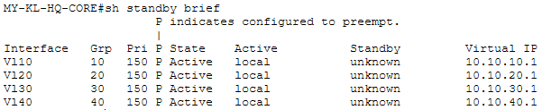
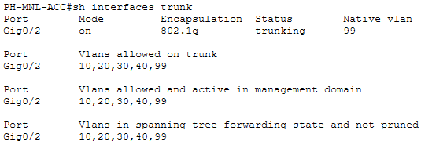
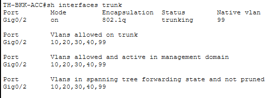
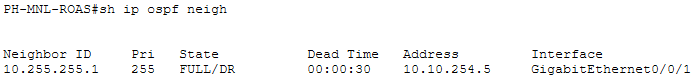
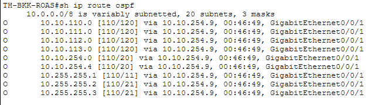
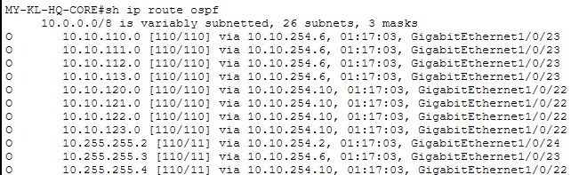
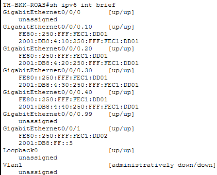
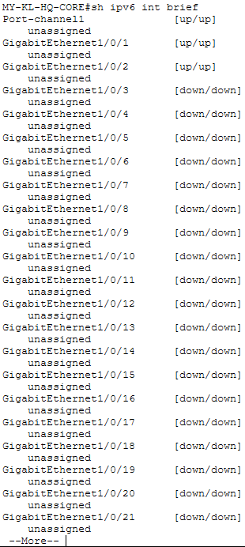

# Phase 1 & 2 — Verification Screenshots

Live `show` command output and topology view from Packet Tracer, captured as evidence that the switching/routing
configs in `../switching/` and `../router-configs/` behave as documented — not just written and assumed correct.
(Converted from the original `screenshots.docx` so it renders directly on GitHub instead of requiring a download.)

## VLANs

**`MY-KL-HQ-CORE# sh vlan brief`**

**`PH-MNL-ACC# sh vlan brief`**

**`TH-BKK-ACC# sh vlan brief`**

## HSRP & Spanning Tree

**`MY-KL-HQ-CORE# sh standby brief`** — all 4 HSRP groups active, no peer (single-core design)

**`MY-KL-HQ-CORE# sh spanning-tree summary`** — rapid-PVST+, PortFast/BPDU Guard enabled

## EtherChannel

`MY-KL-HQ-CORE`'s LACP EtherChannel (`Port-channel1`, `Gi1/0/1-2`) existed from Phase 1 but had no peer to bundle
with until `MY-KL-HQ-DIST` was added specifically to verify it (see `../topologies/asean-network-topology.md`'s
device inventory note and `../switching/MY-KL-HQ-DIST.cfg`). Live testing caught a real issue: the first LACP
negotiation attempt left both member ports stand-alone (`show etherchannel summary` flag `I`, not `P`) despite
byte-for-byte matching config on both switches. Confirmed this wasn't a config error by temporarily testing
static `channel-group 1 mode on`, which bundled immediately — then removing and re-adding LACP channel-group
membership on both switches (`no channel-group 1` / `no channel-protocol lacp` / re-add) reset the LACP state
machine and brought the bundle up cleanly under real LACP. The screenshots below are from that final, working
state.

**`MY-KL-HQ-CORE# sh etherchannel summary`** — `Po1(SU)`, both members `(P)`, protocol LACP

**`MY-KL-HQ-CORE# sh interfaces trunk`** — `Po1` trunking, native VLAN 99, all 5 VLANs allowed

## Trunking

**`PH-MNL-ACC# sh interfaces trunk`**

**`TH-BKK-ACC# sh interfaces trunk`**

## Port Security

**`MY-KL-HQ-CORE# sh port-security int g1/0/11`**

**`PH-MNL-ACC# sh port-security int fa0/1`**

**`TH-BKK-ACC# sh port-security int fa0/1`**

## Management SSH

**`TH-BKK-ACC# ssh -l asean.admin 10.10.110.2`** — cross-site SSH session, TH-BKK-ACC to PH-MNL-ACC

## OSPF Adjacencies

**`MY-KL-HQ-CORE# sh ip ospf neigh`**

**`SG-EDGE-GW# sh ip ospf neigh`**

**`PH-MNL-ROAS# sh ip ospf neigh`**

**`TH-BKK-ROAS# sh ip ospf neigh`**

## End-to-End Reachability

**`PH-MNL-ACC# ping 10.10.120.1`** — 100% success, cross-VLAN via ROAS

**`PH-MNL-ACC# ping 10.10.110.1`** — 100% success

## OSPF Routing Table

**`PH-MNL-ROAS# sh ip route ospf`**

**`TH-BKK-ROAS# sh ip route ospf`**

**`MY-KL-HQ-CORE# sh ip route ospf`** — the hub's own view, showing OSPF routes to both branches (Manila
`10.10.110.0–113.0`, Bangkok `10.10.120.0–123.0`) simultaneously, unlike the branch-side views above which only
see routes back toward HQ and each other. (The `26 subnets` in the header reflects every `10.0.0.0/8` subnet
known to the full routing table, not just the 11 OSPF-learned routes filtered and listed below — a normal IOS
quirk, not a truncated capture.)

## IPv6 Dual-Stack

**`PH-MNL-ROAS# sh ipv6 int brief`**

**`TH-BKK-ROAS# sh ipv6 int brief`**

**`MY-KL-HQ-CORE# sh ipv6 int brief`** — captured in two parts, output paginated past `--More--` at `Gi1/0/21`.
No `Vlan99` entry is expected — VLAN 99 is native-only and was never given its own SVI, consistent with the HSRP
screenshot above (only VLANs 10/20/30/40 have HSRP groups).

**`SG-EDGE-GW# sh ipv6 int brief`**

## Topology Overview

Full Packet Tracer topology view — SG-EDGE-GW (ISR4331) uplinked through MY-KL-HQ-CORE (3650-24PS) to the
Thailand (ISR4321 ROAS + 2960-24TT access) and Philippines (ISR4321 ROAS + 2960-24TT access) branches.

