# Phase 1 & 2 — Verification Screenshots

Live `show` command output and topology view from Packet Tracer, captured as evidence that the switching/routing
configs in `../switching/` and `../router-configs/` behave as documented — not just written and assumed correct.
(Converted from the original `screenshots.docx` so it renders directly on GitHub instead of requiring a download.)

- [`phase-1-basic-connectivity/`](phase-1-basic-connectivity/) — VLANs, trunking, EtherChannel, HSRP/STP, port
  security, SSH
- [`phase-2-dynamic-routing-ipv6/`](phase-2-dynamic-routing-ipv6/) — OSPF adjacencies/routes, IPv4 reachability,
  IPv6 addressing and routing

Ordered start to finish, from the physical topology through to the last thing actually built and verified
(IPv6 cross-site routing) — file numbers in `./phase-1-basic-connectivity/` and
`./phase-2-dynamic-routing-ipv6/` follow this same order.

## Topology Overview

Full Packet Tracer topology view — SG-EDGE-GW (ISR4331) uplinked through MY-KL-HQ-CORE (3650-24PS) to the
Thailand (ISR4321 ROAS + 2960-24TT access) and Philippines (ISR4321 ROAS + 2960-24TT access) branches, with
MY-KL-HQ-DIST (3650-24PS) hanging off MY-KL-HQ-CORE as its LACP EtherChannel peer.

  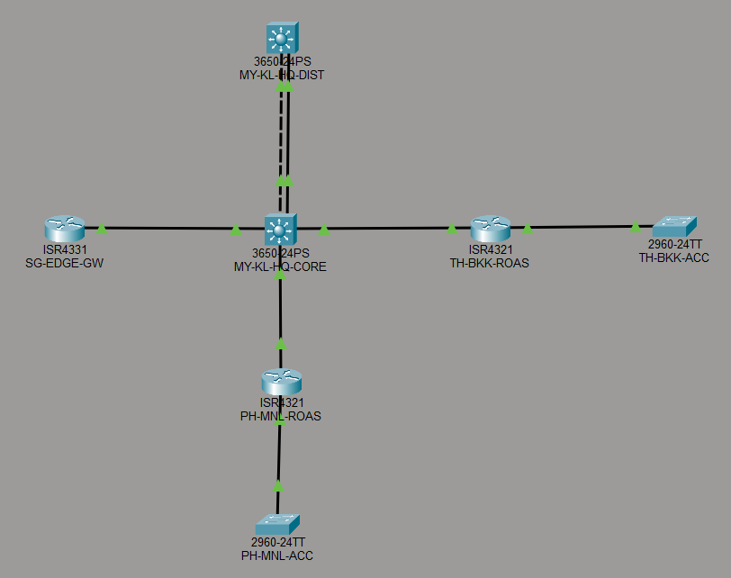 
  Full topology view

## VLANs

   
  <code>MY-KL-HQ-CORE# sh vlan brief</code>

  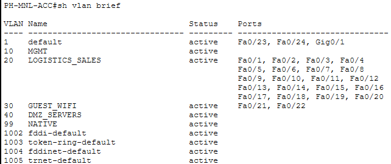 
  <code>PH-MNL-ACC# sh vlan brief</code>

   
  <code>TH-BKK-ACC# sh vlan brief</code>

## Trunking

   
  <code>PH-MNL-ACC# sh interfaces trunk</code>

   
  <code>TH-BKK-ACC# sh interfaces trunk</code>

## EtherChannel

`MY-KL-HQ-CORE`'s LACP EtherChannel (`Port-channel1`, `Gi1/0/1-2`) existed from Phase 1 but had no peer to bundle
with until `MY-KL-HQ-DIST` was added specifically to verify it (see `../topologies/asean-network-topology.md`'s
device inventory note and `../switching/MY-KL-HQ-DIST.cfg`). Live testing caught a real issue: the first LACP
negotiation attempt left both member ports stand-alone (`show etherchannel summary` flag `I`, not `P`) despite
byte-for-byte matching config on both switches. Confirmed this wasn't a config error by temporarily testing
static `channel-group 1 mode on`, which bundled immediately — then removing and re-adding LACP channel-group
membership on both switches (`no channel-group 1` / `no channel-protocol lacp` / re-add) reset the LACP state
machine and brought the bundle up cleanly under real LACP. The screenshots below are from that final, working
state.

  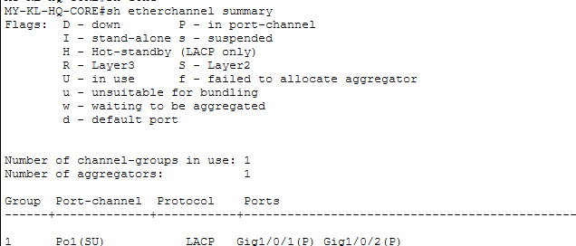 
  <code>MY-KL-HQ-CORE# sh etherchannel summary</code> — <code>Po1(SU)</code>, both members <code>(P)</code>, protocol LACP

  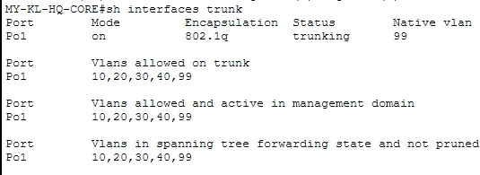 
  <code>MY-KL-HQ-CORE# sh interfaces trunk</code> — <code>Po1</code> trunking, native VLAN 99, all 5 VLANs allowed

## HSRP & Spanning Tree

   
  <code>MY-KL-HQ-CORE# sh standby brief</code> — all 4 HSRP groups active, no peer (single-core design)

  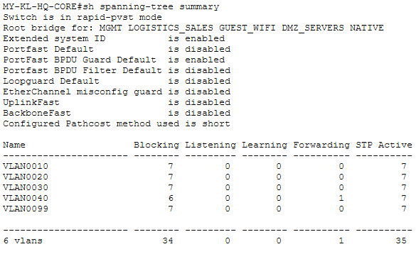 
  <code>MY-KL-HQ-CORE# sh spanning-tree summary</code> — rapid-PVST+, PortFast/BPDU Guard enabled

`PH-MNL-ACC# sh spanning-tree summary` and `TH-BKK-ACC# sh spanning-tree summary` both show `Root bridge for:
MGMT LOGISTICS_SALES GUEST_WIFI DMZ_SERVERS NATIVE`, i.e. each access switch is root of its *own* domain, not a
subordinate of `MY-KL-HQ-CORE`. That's correct, not a misconfiguration: each access switch sits behind its
site's ROAS *router* (`PH-MNL-ROAS`/`TH-BKK-ROAS`), and a router is a Layer 3 boundary that doesn't forward
BPDUs - there's no Layer 2 path back to `MY-KL-HQ-CORE`'s spanning-tree domain at all, so each access switch is
necessarily isolated in its own local instance. What actually matters is confirmed on both: 0 blocking ports,
all 6 VLANs forwarding cleanly.

  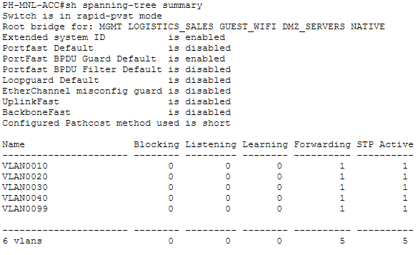 
  <code>PH-MNL-ACC# sh spanning-tree summary</code>

   
  <code>TH-BKK-ACC# sh spanning-tree summary</code>

## Port Security

  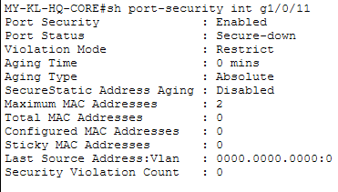 
  <code>MY-KL-HQ-CORE# sh port-security int g1/0/11</code>

   
  <code>PH-MNL-ACC# sh port-security int fa0/1</code>

  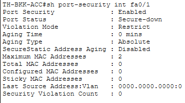 
  <code>TH-BKK-ACC# sh port-security int fa0/1</code>

## Management SSH

   
  <code>TH-BKK-ACC# ssh -l asean.admin 10.10.110.2</code> — cross-site SSH session, TH-BKK-ACC to PH-MNL-ACC

## OSPF Adjacencies

  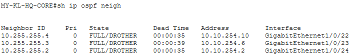 
  <code>MY-KL-HQ-CORE# sh ip ospf neigh</code>

   
  <code>SG-EDGE-GW# sh ip ospf neigh</code>

   
  <code>PH-MNL-ROAS# sh ip ospf neigh</code>

  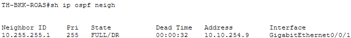 
  <code>TH-BKK-ROAS# sh ip ospf neigh</code>

## OSPF Routing Table

   
  <code>PH-MNL-ROAS# sh ip route ospf</code>

   
  <code>TH-BKK-ROAS# sh ip route ospf</code>

`MY-KL-HQ-CORE# sh ip route ospf` is the hub's own view, showing OSPF routes to both branches (Manila
`10.10.110.0–113.0`, Bangkok `10.10.120.0–123.0`) simultaneously, unlike the branch-side views above which only
see routes back toward HQ and each other. (The `26 subnets` in the header reflects every `10.0.0.0/8` subnet
known to the full routing table, not just the 11 OSPF-learned routes filtered and listed below — a normal IOS
quirk, not a truncated capture.)

   
  <code>MY-KL-HQ-CORE# sh ip route ospf</code>

## End-to-End Reachability

   
  <code>PH-MNL-ACC# ping 10.10.120.1</code> — 100% success, cross-VLAN via ROAS

`PH-MNL-ACC# ping 10.10.110.1` below is 100% success, but it's really PH-MNL-ACC reaching its own local default
gateway (PH-MNL-ROAS's MGMT sub-interface) rather than a cross-site test — the genuinely cross-site counterpart
follows it.

  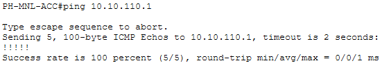 
  <code>PH-MNL-ACC# ping 10.10.110.1</code>

  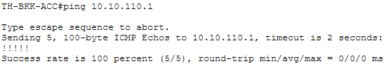 
  <code>TH-BKK-ACC# ping 10.10.110.1</code> — genuinely cross-site: Bangkok's access switch reaching Manila's ROAS router, routed via OSPF through MY-KL-HQ-CORE

## IPv6 Dual-Stack

  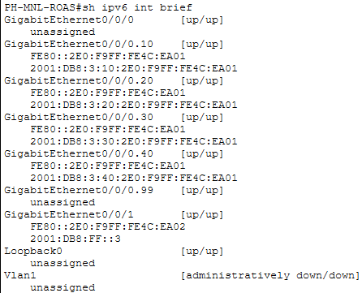 
  <code>PH-MNL-ROAS# sh ipv6 int brief</code>

   
  <code>TH-BKK-ROAS# sh ipv6 int brief</code>

`MY-KL-HQ-CORE# sh ipv6 int brief` was captured in two parts below, output paginated past `--More--` at
`Gi1/0/21`. No `Vlan99` entry is expected — VLAN 99 is native-only and was never given its own SVI, consistent
with the HSRP screenshot above (only VLANs 10/20/30/40 have HSRP groups).

   
  <code>MY-KL-HQ-CORE# sh ipv6 int brief</code> — part 1

   
  <code>MY-KL-HQ-CORE# sh ipv6 int brief</code> — part 2

  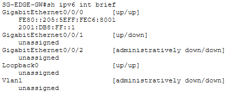 
  <code>SG-EDGE-GW# sh ipv6 int brief</code>

## IPv6 Cross-Site Routing

The screenshots above only prove IPv6 *addressing* exists on every device — none of it proves IPv6 can actually
*route* between sites. Closing that gap turned into a real finding.

**OSPFv3 was configured and live-tested first**, mirroring the existing OSPFv2 design exactly: same router-IDs
(`10.255.255.1-4`), same area 0, `ipv6 unicast-routing` confirmed present on every device. It never worked.
`show ipv6 ospf interface brief` showed every interface correctly registered under area 0 (config confirmed
correct multiple ways: `show ipv6 protocols`, per-interface state, a full interface bounce, and a full removal
and rebuild of the OSPFv3 process) — yet `Nbrs F/C` stayed `0/0` everywhere, including the simplest possible
case: a single directly-connected pair (`MY-KL-HQ-CORE` ↔ `SG-EDGE-GW`) with a freshly rebuilt process on both
ends. OSPFv2 forms adjacencies perfectly on these exact same physical links. This is a confirmed Packet Tracer
9.0.0 OSPFv3 simulation limitation, not a configuration error — joining the other confirmed platform gaps this
project has documented (SNMPv3, spanning-tree extend/loopguard, the SVI `ip access-group` bug, no real-NIC
bridge, and `show lacp`/`passive-interface` command-parsing gaps found earlier in this same evidence pass).

**Static routes replaced it**, mirroring a pattern this project's own IPv4 design already used (see the "Phase 1
static default route" comments in `PH-MNL-ROAS.cfg`/`TH-BKK-ROAS.cfg`'s OSPF sections, from before OSPFv2 was
proven working). `MY-KL-HQ-CORE` is the hub, so it only needs one summarized route per remote site — every site's
4 VLANs share a single `/48`. Each spoke (`SG-EDGE-GW`, `PH-MNL-ROAS`, `TH-BKK-ROAS`) just needs a single default
route back to the hub, its only way out. See the matching `ipv6 route` comments in each device's `.cfg` file.

   
  <code>MY-KL-HQ-CORE# sh ipv6 route</code> — two static routes, one summarized <code>/48</code> per remote site

  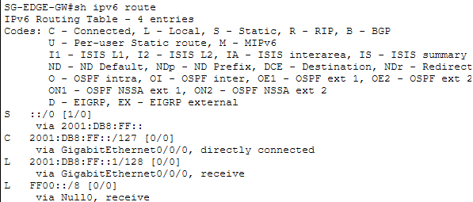 
  <code>SG-EDGE-GW# sh ipv6 route</code> — single default route back to the hub

   
  <code>PH-MNL-ROAS# sh ipv6 route</code> — single default route back to the hub

   
  <code>TH-BKK-ROAS# sh ipv6 route</code> — single default route back to the hub

This is the real end-to-end proof: IPv6 dual-stack now means addressing *and* routing, not just addressing.

  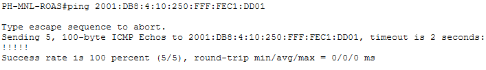 
  <code>PH-MNL-ROAS# ping 2001:DB8:4:10:250:FFF:FEC1:DD01</code> — genuinely cross-site (Manila to Bangkok's MGMT address), 100% success

