# Phase 3 — Verification Screenshots

Live `show` command output from Packet Tracer, captured as evidence that the security-hardening config in
`../../01-regional-on-premises-network/switching/` and `router-configs/` behaves as documented in
[`../phase3-plan.md`](../phase3-plan.md) — not just written and assumed correct.

- [`layer2-active-defense/`](layer2-active-defense/) — DHCP Snooping, Dynamic ARP Inspection
- [`nat/`](nat/) — static NAT + PAT overload on `SG-EDGE-GW`
- [`access-control-lists/`](access-control-lists/) — `MGMT-SSH-ONLY`, `GUEST-CONTAINMENT`, `WAN-EDGE-INBOUND`
- [`ntp-and-snmp/`](ntp-and-snmp/) — SNMP agent status on `MY-KL-HQ-CORE`
- [`tftp-backup/`](tftp-backup/) — `copy running-config tftp:`, including a genuine failure and fix, not just the
  final success

**Gap found and fixed while capturing this evidence:** `SG-EDGE-GW`'s live ACL set was initially missing
`WAN-EDGE-INBOUND` entirely — that ACL is committed in `SG-EDGE-GW.cfg` (added to close the unfiltered DMZ
exposure) but had never actually been typed into the live Packet Tracer lab. Applied it live and recaptured;
`access-control-lists/04-access-lists-sg-edge-gw.png` now shows the corrected, complete state. Along the way,
`permit ?` inside the ACL's config mode confirmed `esp` is a supported protocol keyword on this platform (no
numeric protocol-ID option was even offered) — the `.cfg` file's original numeric `permit 50 ...` fallback was
corrected to `permit esp ...` to match what's actually confirmed working.

## Layer 2 Active Defense

**DHCP Snooping** — enabled on VLANs 10/20/30/40 everywhere. Two things worth flagging honestly rather than
glossing over, both only visible on `MY-KL-HQ-CORE`'s output (the access switches use a shorter/different
`show ip dhcp snooping` template on their platform that doesn't include these fields at all, so there's nothing
to cross-check against):
- `DHCP snooping is operational on following VLANs: none` — despite `configured on following VLANs: 10,20,30,40`
  immediately above it. "Configured" and "operational" showing different results on the same device is worth
  investigating rather than assuming it's fine; it might be a genuine gap, or it might be another Packet Tracer
  simulation quirk like the others already confirmed in `../../01-regional-on-premises-network/evidences/platform-limitations/`.
  Not confirmed either way yet.
- The "DHCP snooping trust/rate is configured on the following Interfaces" table has a header row but zero
  interface entries under it — `MY-KL-HQ-CORE` has no explicitly trusted port for snooping. This *might* be
  correct (its DHCP relay happens at Layer 3 via `ip helper-address` on the SVI itself, not through a locally
  snooped Layer 2 uplink the way the access switches' relay path works), but that's a plausible explanation, not
  a verified one - don't take it as confirmed without checking further.

The two access switches are unambiguous, by contrast: each trusts exactly its uplink toward the router that
performs the actual relay, everything else untrusted.

  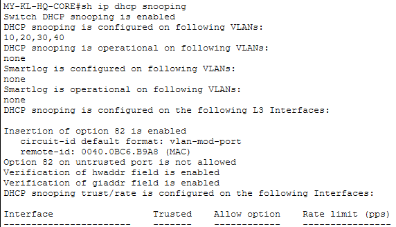 
  <code>MY-KL-HQ-CORE# sh ip dhcp snooping</code> — see the two flagged items above

  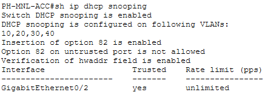 
  <code>PH-MNL-ACC# sh ip dhcp snooping</code> — <code>Gi0/2</code> (uplink to <code>PH-MNL-ROAS</code>) trusted

  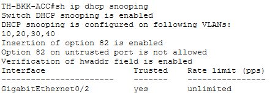 
  <code>TH-BKK-ACC# sh ip dhcp snooping</code> — <code>Gi0/2</code> (uplink to <code>TH-BKK-ROAS</code>) trusted

**Dynamic ARP Inspection** — same trust pattern as DHCP Snooping (DAI relies on the DHCP Snooping binding table,
so the trust boundaries have to match): every access port untrusted, only the uplink toward the router/core
trusted.

  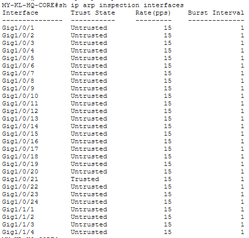 
  <code>MY-KL-HQ-CORE# sh ip arp inspection interfaces</code>

  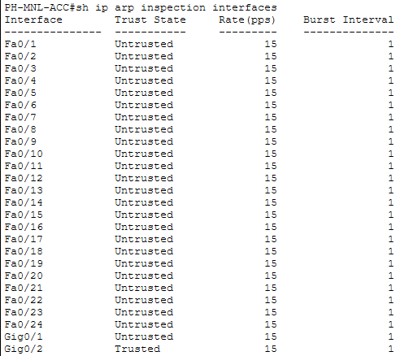 
  <code>PH-MNL-ACC# sh ip arp inspection interfaces</code> — <code>Gi0/2</code> trusted, matching DHCP Snooping

  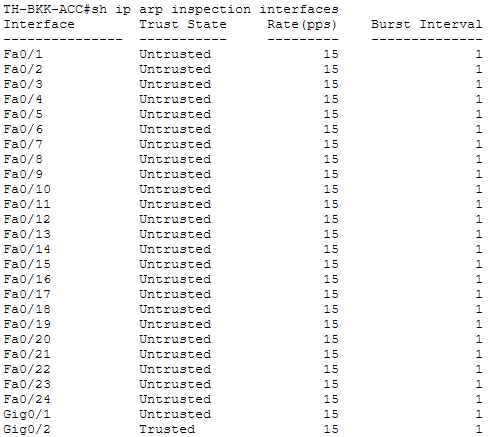 
  <code>TH-BKK-ACC# sh ip arp inspection interfaces</code> — <code>Gi0/2</code> trusted, matching DHCP Snooping

## NAT

**`SG-EDGE-GW`** — 1 static translation programmed (the DMZ core services host, `10.10.40.10` → `203.0.113.3`),
`GigabitEthernet0/0/1` outside / `GigabitEthernet0/0/0` inside. `Hits: 0` is expected — this topology doesn't
model an end-host actually generating outbound traffic through the PAT overload rule, so the counter has
nothing to increment from yet; this confirms the rule is programmed correctly, not that it's been exercised.

  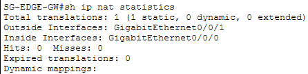 
  <code>SG-EDGE-GW# sh ip nat statistics</code>

## Access Control Lists

**`MY-KL-HQ-CORE`** — all 4 ACLs (`MGMT-SSH-ONLY`, `GUEST-CONTAINMENT`, and their IPv6 `-V6` counterparts) in one
view. No match counts shown here on `GUEST-CONTAINMENT` — this particular capture only confirms the ACL is
correctly programmed on this device, not that it's actively blocking anything. Real enforcement proof (a genuine
deny hit count) is captured below, on `PH-MNL-ROAS`.

  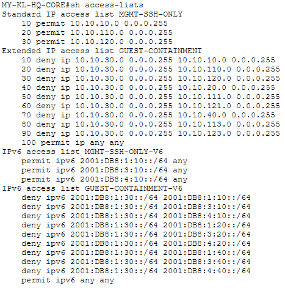 
  <code>MY-KL-HQ-CORE# sh access-lists</code>

**`PH-MNL-ACC`** and **`TH-BKK-ACC`** — both carry `MGMT-SSH-ONLY` only (no local `GUEST-CONTAINMENT` copy; that
ACL lives on the ROAS routers instead, per `../phase3-plan.md`'s ACL placement design).

  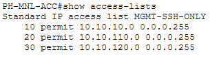 
  <code>PH-MNL-ACC# show access-lists</code>

  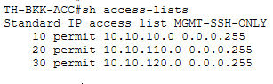 
  <code>TH-BKK-ACC# sh access-lists</code>

**`SG-EDGE-GW`** — all 4 ACLs now present: `NAT-INSIDE-HOSTS`, `MGMT-SSH-ONLY`, `WAN-EDGE-INBOUND` (fixed live,
see the note at the top of this file), and `MGMT-SSH-ONLY-V6`. IOS displays `WAN-EDGE-INBOUND`'s IKE ports back
as `isakmp`/`non500-isakmp` rather than `500`/`4500` — that's just Cisco's standard friendly-name translation
for well-known ports, not a discrepancy from what was actually configured.

  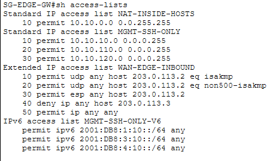 
  <code>SG-EDGE-GW# sh access-lists</code> — all 4 ACLs present, including the fixed <code>WAN-EDGE-INBOUND</code>

**`PH-MNL-ROAS` — real enforcement, not just configuration.** A temporary test PC (`TEST-PC1`, `10.10.112.50`,
connected to `PH-MNL-ACC`'s real `GUEST_WIFI` access port `Fa0/21`) pinged `PH-MNL-ROAS`'s own MGMT address
(`10.10.110.1`) — squarely inside `GUEST-CONTAINMENT`'s deny rule. The ping genuinely failed
(`Destination host unreachable`, sourced from `10.10.112.1` — `PH-MNL-ROAS`'s own GUEST_WIFI-facing interface,
confirming the router itself blocked it rather than a generic timeout), and the ACL's deny counter incremented
for real: `20 deny ip 10.10.112.0 ... 10.10.110.0 ... (4 match(es))`. This is the one piece of evidence in this
folder that proves an ACL is actively enforcing something, not just sitting correctly configured.
`TEST-PC1`/`TEST-HUB`/`TEST-PC2` were removed afterward - temporary test scaffolding, not part of the permanent
topology.

  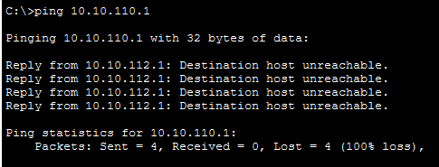 
  <code>TEST-PC1 (10.10.112.50)# ping 10.10.110.1</code> — 100% loss, <code>Destination host unreachable</code> from <code>PH-MNL-ROAS</code>

  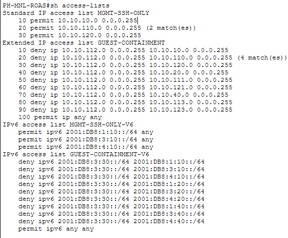 
  <code>PH-MNL-ROAS# sh access-lists</code> — <code>GUEST-CONTAINMENT</code> deny rule 20 shows <code>(4 match(es))</code>, genuine enforcement

## NTP & SNMP

**NTP has no verification evidence here yet — an acknowledged gap, not an oversight.** `MY-KL-HQ-CORE` is
configured `ntp master 3`, and every other device (`PH-MNL-ACC`, `TH-BKK-ACC`, `PH-MNL-ROAS`, `TH-BKK-ROAS`,
`SG-EDGE-GW`) is configured `ntp server 10.255.255.1` pointing at it — a real, topology-wide hierarchy, not just a
single command on one box. Despite that, nothing in this repo confirms it actually works: no `show ntp status`,
`show ntp associations`, or `show clock detail` anywhere. Closing this needs a screenshot from one of the client
devices showing `Clock is synchronized` (or equivalent) against `MY-KL-HQ-CORE`, taken live in Packet Tracer.

**`show snmp` (bare, no arguments) returns genuinely empty output on this platform** — not a structured
zero-counters report the way real Cisco IOS shows, and not what was originally predicted before actually running
it. Confirmed the command itself is accepted (no error), it just produces nothing. This is the SNMPv2c
community-string fallback confirmed present (`snmp-server community` — SNMPv3 isn't supported on this Packet
Tracer build, see `../../01-regional-on-premises-network/evidences/platform-limitations/`), just with a command
that doesn't report much back.

  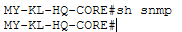 
  <code>MY-KL-HQ-CORE# sh snmp</code> — genuinely empty output, confirmed rather than assumed

## TFTP Configuration Backup

`phase3-plan.md` calls for a real `copy running-config tftp:` backup, per the CCNA 4.9 objective. First attempt
genuinely failed — `10.10.40.10` was a placeholder address with no real device behind it yet (see
`phase3-plan.md`'s "Server inventory"), so the transfer timed out waiting for something that didn't exist.

  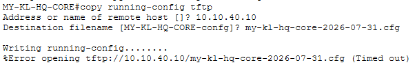 
  <code>MY-KL-HQ-CORE# copy running-config tftp:</code> — <code>%Error opening tftp://10.10.40.10/...(Timed out)</code>

Rather than just documenting the failure and moving on, a real TFTP server (`MY-KL-DMZ-SRV`, `10.10.40.10`) was
added to the topology — a Packet Tracer Server device on `MY-KL-HQ-CORE`'s `Gi1/0/21`, matching the DMZ_SERVERS
VLAN's addressing exactly. With the server actually in place and its TFTP service enabled, the same command
succeeds for real (accepting IOS's own default destination filename, `MY-KL-HQ-CORE-confg`, rather than the
dated custom filename `phase3-plan.md`'s workflow section recommends — worth using a dated name if this backup
is ever repeated later in the project):

  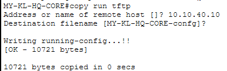 
  <code>MY-KL-HQ-CORE# copy run tftp</code> — <code>[OK - 10721 bytes]</code>

Confirmed from the other side too — the server's own file listing shows the uploaded config, not just the
router's word for it:

  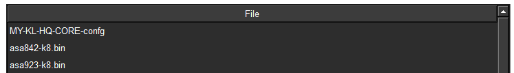 
  <code>MY-KL-DMZ-SRV</code> Config → Services → TFTP file list — <code>MY-KL-HQ-CORE-confg</code> present

**Acknowledged evidence gap:** these three screenshots prove the TFTP transfer itself worked, but
`MY-KL-HQ-CORE.cfg`'s `GigabitEthernet1/0/21` block (`switchport access vlan 40`, port-security maximum 1) was
written to match this section's prose, not verified against a live capture of that specific interface. No
`sh vlan brief` or `sh port-security interface Gi1/0/21` since the server was added confirms the live port
actually matches what's now committed. Worth a quick recapture to close the loop.
