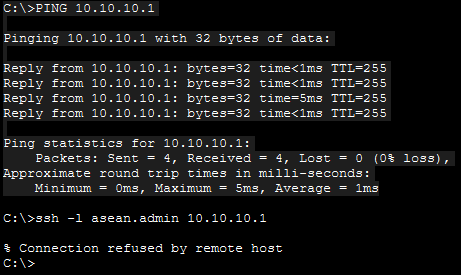
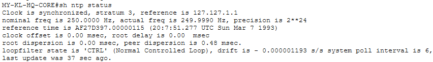
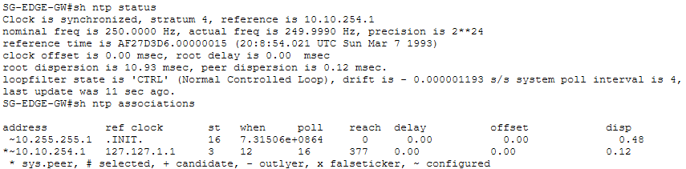
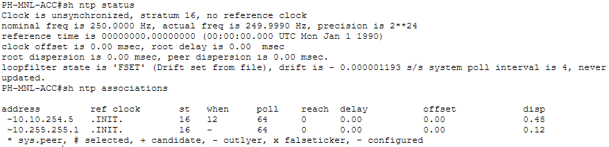
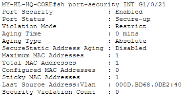
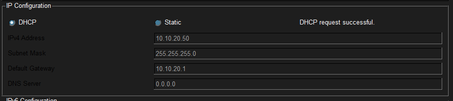
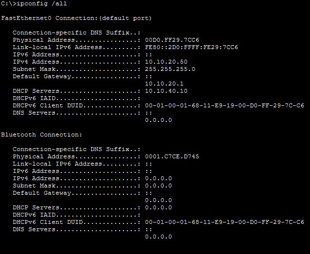

# Phase 3 — Verification Screenshots

Live `show` command output from Packet Tracer, captured as evidence that the security-hardening config in
`../../01-regional-on-premises-network/switching/` and `router-configs/` behaves as documented in
[`../phase3-plan.md`](../phase3-plan.md) — not just written and assumed correct.

- [`layer2-active-defense/`](layer2-active-defense/) — DHCP Snooping, Dynamic ARP Inspection
- [`nat/`](nat/) — static NAT + PAT overload on `SG-EDGE-GW`
- [`access-control-lists/`](access-control-lists/) — `MGMT-SSH-ONLY`, `GUEST-CONTAINMENT`, `WAN-EDGE-INBOUND`
- [`ntp-and-snmp/`](ntp-and-snmp/) — NTP sync tested from 4 devices (hop-count-limited on this platform), SNMP
  agent status on `MY-KL-HQ-CORE`
- [`tftp-backup/`](tftp-backup/) — `copy running-config tftp:`, including a genuine failure and fix, not just the
  final success
- [`dhcp-relay/`](dhcp-relay/) — real client lease through the relay, including a genuine DHCP-snooping-trust
  failure and fix, not just the final success

**Gap found and fixed while capturing this evidence:** `SG-EDGE-GW`'s live ACL set was initially missing
`WAN-EDGE-INBOUND` entirely — that ACL is committed in `SG-EDGE-GW.cfg` (added to close the unfiltered DMZ
exposure) but had never actually been typed into the live Packet Tracer lab. Applied it live and recaptured;
`access-control-lists/04-access-lists-sg-edge-gw.png` now shows the corrected, complete state. Along the way,
`permit ?` inside the ACL's config mode confirmed `esp` is a supported protocol keyword on this platform (no
numeric protocol-ID option was even offered) — the `.cfg` file's original numeric `permit 50 ...` fallback was
corrected to `permit esp ...` to match what's actually confirmed working.

## Layer 2 Active Defense

**DHCP Snooping** — enabled on VLANs 10/20/30/40 everywhere. Two things worth flagging honestly rather than
glossing over, both only visible on `MY-KL-HQ-CORE`'s output (the access switches use a shorter/different
`show ip dhcp snooping` template on their platform that doesn't include these fields at all, so there's nothing
to cross-check against):
- `DHCP snooping is operational on following VLANs: none` — despite `configured on following VLANs: 10,20,30,40`
  immediately above it, and still shown as `none` even in the recaptured screenshot below. **Now confirmed
  misleading, not a real gap:** the live DHCP relay test (see [`dhcp-relay/`](dhcp-relay/) below) proved DHCP
  snooping is genuinely operating on this device - it's the exact mechanism that dropped the DHCP server's
  replies before the trust fix, and stopped dropping them after. A feature that's actively enforcing its own
  trust boundary is by definition operational. Same lesson as `show spanning-tree summary` and `show ntp
  status` elsewhere in this project: this specific status line just isn't reliable on this platform, verify
  functionally instead of trusting the self-report.
- **Resolved, and it was a real gap, not a fine-either-way design choice.** The "DHCP snooping trust/rate is
  configured on the following Interfaces" table originally had zero entries — `MY-KL-HQ-CORE` had no explicitly
  trusted port for snooping. The live DHCP relay test proved this was actively breaking DHCP: `MY-KL-DMZ-SRV`'s
  replies, arriving on the untrusted `Gi1/0/21`, were being silently dropped before they could reach the relayed
  client. Fixed with `ip dhcp snooping trust` on `Gi1/0/21` - the recaptured screenshot below now shows both
  `Gi1/0/21` (trusted) and `Gi1/0/11` (untrusted, populated once real DHCP traffic actually crossed it during
  testing - it wasn't listed at all before any DHCP traffic existed).

The two access switches are unambiguous, by contrast: each trusts exactly its uplink toward the router that
performs the actual relay, everything else untrusted.

   
  <code>MY-KL-HQ-CORE# sh ip dhcp snooping</code> — see the two flagged items above

   
  <code>PH-MNL-ACC# sh ip dhcp snooping</code> — <code>Gi0/2</code> (uplink to <code>PH-MNL-ROAS</code>) trusted

   
  <code>TH-BKK-ACC# sh ip dhcp snooping</code> — <code>Gi0/2</code> (uplink to <code>TH-BKK-ROAS</code>) trusted

**Dynamic ARP Inspection** — the two access switches are unambiguous: each trusts exactly its uplink toward the
router that performs the actual relay, everything else untrusted. `MY-KL-HQ-CORE` is a different story, and worth
documenting in full rather than assuming it matches.

**Found and live-tested, not assumed:** the DHCP Snooping trust fix above only added `ip dhcp snooping trust` to
`Gi1/0/21` - `Gi1/0/21` remained untrusted for ARP inspection, and `MY-KL-DMZ-SRV` (statically addressed) has zero
DHCP-snooping-learned bindings. On real Cisco hardware, an untrusted port with no matching binding should have its
ARP replies dropped by DAI. Tested directly: cleared `MY-KL-HQ-CORE`'s ARP cache (`clear arp-cache`) to force a
genuinely fresh ARP exchange with `10.10.40.10`, then pinged it. The ping succeeded 100 percent, and
`show ip arp inspection statistics vlan 40` stayed at all zeros (`Forwarded: 0, Dropped: 0`) both before and after —
meaning either DAI isn't actually enforcing this scenario on this platform, or its statistics simply don't reflect
what's happening. Either way, the same class of finding as `show spanning-tree summary` and `show ntp status`
elsewhere in this project: something that doesn't reliably report reality, confirmed by testing rather than
assumed from the command's face value.

`ip arp inspection trust` was added to `Gi1/0/21` in `MY-KL-HQ-CORE.cfg` regardless - not because a live bug was
fixed (there wasn't one to fix, functionally), but because it's what real Catalyst hardware would actually
require for a statically-addressed server, and it keeps this port's DHCP-snooping/ARP-inspection trust state
consistent. Applied live and recaptured below - confirmed.

   
  <code>MY-KL-HQ-CORE# sh ip arp inspection interfaces</code> — <code>Gi1/0/21</code> now <code>Trusted</code>, applied and confirmed live

   
  <code>PH-MNL-ACC# sh ip arp inspection interfaces</code> — <code>Gi0/2</code> trusted, matching DHCP Snooping

   
  <code>TH-BKK-ACC# sh ip arp inspection interfaces</code> — <code>Gi0/2</code> trusted, matching DHCP Snooping

## NAT

**`SG-EDGE-GW`** — 1 static translation programmed (the DMZ core services host, `10.10.40.10` → `203.0.113.3`),
`GigabitEthernet0/0/1` outside / `GigabitEthernet0/0/0` inside.

**`Hits: 0` is confirmed structurally untestable in this lab, not just untried.** Traced all the way down rather
than assumed: pinged `203.0.113.1` (the default-route next hop) from `MY-KL-DMZ-SRV` and got `Destination host
unreachable` from `MY-KL-HQ-CORE`'s own `Vlan40` SVI - meaning it never even forwarded the packet. Root cause
chased through two layers: (1) `SG-EDGE-GW`'s static default route was never propagated into OSPF at all (no
`default-information originate` anywhere in the topology, confirmed via `grep` across every `.cfg`) - added it,
but (2) `SG-EDGE-GW`'s own `Gi0/0/1` (the interface that route depends on) shows `down/down` in
`show ip interface brief` - the IP (`203.0.113.2`) is correctly configured, but there's no physical link. That's
expected, not a bug: this is the same interface `../../03-aws-cloud-infrastructure/phase4-plan.md` already
documents as having no real internet/AWS reachability - nothing was ever meant to be plugged into it. `default-
information originate` was added to `SG-EDGE-GW.cfg`'s OSPF process anyway (correct for real hardware once a real
uplink exists), but it can't produce a route while the interface it depends on has no link partner. Deliberately
not working around this with a fake stand-in "ISP" device - unlike `TEST-PC1`/`TEST-DHCP-PC` (real categories of
device that legitimately belong in this topology), a placeholder ISP router would represent nothing real, just
manufacture a nonzero counter. `Hits: 0` is the honest, fully-diagnosed answer, not an untested gap.

   
  <code>SG-EDGE-GW# sh ip nat statistics</code> — <code>Hits: 0</code>, confirmed structural (see above), not untested

## Access Control Lists

**`MY-KL-HQ-CORE`** — all 4 ACLs (`MGMT-SSH-ONLY`, `GUEST-CONTAINMENT`, and their IPv6 `-V6` counterparts) in one
view. No match counts shown here on `GUEST-CONTAINMENT` — this particular capture only confirms the ACL is
correctly programmed on this device, not that it's actively blocking anything. Real enforcement proof (a genuine
deny hit count) is captured below, on `PH-MNL-ROAS`.

   
  <code>MY-KL-HQ-CORE# sh access-lists</code>

**`PH-MNL-ACC`** and **`TH-BKK-ACC`** — both carry `MGMT-SSH-ONLY` only (no local `GUEST-CONTAINMENT` copy; that
ACL lives on the ROAS routers instead, per `../phase3-plan.md`'s ACL placement design).

   
  <code>PH-MNL-ACC# show access-lists</code>

   
  <code>TH-BKK-ACC# sh access-lists</code>

**`SG-EDGE-GW`** — all 4 ACLs now present: `NAT-INSIDE-HOSTS`, `MGMT-SSH-ONLY`, `WAN-EDGE-INBOUND` (fixed live,
see the note at the top of this file), and `MGMT-SSH-ONLY-V6`. IOS displays `WAN-EDGE-INBOUND`'s IKE ports back
as `isakmp`/`non500-isakmp` rather than `500`/`4500` — that's just Cisco's standard friendly-name translation
for well-known ports, not a discrepancy from what was actually configured.

   
  <code>SG-EDGE-GW# sh access-lists</code> — all 4 ACLs present, including the fixed <code>WAN-EDGE-INBOUND</code>

**`PH-MNL-ROAS` — real enforcement, not just configuration.** A temporary test PC (`TEST-PC1`, `10.10.112.50`,
connected to `PH-MNL-ACC`'s real `GUEST_WIFI` access port `Fa0/21`) pinged `PH-MNL-ROAS`'s own MGMT address
(`10.10.110.1`) — squarely inside `GUEST-CONTAINMENT`'s deny rule. The ping genuinely failed
(`Destination host unreachable`, sourced from `10.10.112.1` — `PH-MNL-ROAS`'s own GUEST_WIFI-facing interface,
confirming the router itself blocked it rather than a generic timeout), and the ACL's deny counter incremented
for real: `20 deny ip 10.10.112.0 ... 10.10.110.0 ... (4 match(es))`. This is real, live enforcement proof, not
just correctly-sitting configuration - `MGMT-SSH-ONLY` gets its own equally real enforcement proof below.
`TEST-PC1`/`TEST-HUB`/`TEST-PC2` were removed afterward - temporary test scaffolding, not part of the permanent
topology.

   
  <code>TEST-PC1 (10.10.112.50)# ping 10.10.110.1</code> — 100% loss, <code>Destination host unreachable</code> from <code>PH-MNL-ROAS</code>

   
  <code>PH-MNL-ROAS# sh access-lists</code> — <code>GUEST-CONTAINMENT</code> deny rule 20 shows <code>(4 match(es))</code>, genuine enforcement

**`MGMT-SSH-ONLY` — real enforcement too, not just the permit side.** Every other piece of evidence for this ACL
only shows it *permitting* legitimate MGMT-sourced traffic (the cross-site SSH session in
`../../01-regional-on-premises-network/evidences/`, match counts on `PH-MNL-ROAS` above) - nothing had shown it
actually refusing an unauthorized source, since this is a standard ACL with only an *implicit* deny (no explicit
`deny` line to attach a visible match counter to, unlike `GUEST-CONTAINMENT`). Tested behaviorally instead: a
temporary `TEST-SSH-PC` on `MY-KL-HQ-CORE`'s `LOGISTICS_SALES` range (`10.10.20.0/24`, outside every subnet
`MGMT-SSH-ONLY` permits) first confirmed general reachability (`ping 10.10.10.1`, 100% success - ruling out a
generic connectivity problem), then attempted SSH to the same address and got `% Connection refused by remote
host` - refused at the VTY `access-class` check itself, before any SSH banner or password prompt. Same temporary
test PC pattern as `TEST-PC1` above - removed after capturing this evidence.

   
  <code>TEST-SSH-PC# ping 10.10.10.1</code> — 100% success, then <code>ssh -l asean.admin 10.10.10.1</code> — <code>% Connection refused by remote host</code>, <code>MGMT-SSH-ONLY</code> genuinely blocking a non-MGMT source

## NTP & SNMP

**NTP verification, live-tested from four devices — a genuinely mixed, but now fully characterized, result.**
`MY-KL-HQ-CORE` is configured `ntp master 3`, and every other device (`PH-MNL-ACC`, `TH-BKK-ACC`, `PH-MNL-ROAS`,
`TH-BKK-ROAS`, `SG-EDGE-GW`) is configured `ntp server 10.255.255.1` pointing at it — a real, topology-wide
hierarchy, not just a single command on one box.

   
  <code>MY-KL-HQ-CORE# sh ntp status</code> — <code>synchronized, stratum 3, reference 127.127.1.1</code> (its own internal clock), actively updating

The master itself is healthy. What the clients revealed is a genuine, reproducible Packet Tracer 9.0.0 NTP
limitation, confirmed from **four independent devices**, the same cross-check standard used for the OSPFv3
finding: **devices directly (one hop) adjacent to `MY-KL-HQ-CORE` sync successfully, but only via a
spontaneously-appearing association to the master's WAN-facing interface — never via the loopback
(`10.255.255.1`) every device is actually configured to query, which stays at `.INIT.`/`reach 0` everywhere,
permanently.** `SG-EDGE-GW` (one hop) reached `stratum 4` via `10.10.254.1`; `PH-MNL-ROAS` (also one hop, not
separately screenshotted, cited here as the second confirming device) reached `stratum 4` via `10.10.254.5` -
both are the master's directly-connected WAN interface toward that device, not the configured target.

   
  <code>SG-EDGE-GW# sh ntp status</code> / <code>sh ntp associations</code> — synced to <code>stratum 4</code>, but via <code>10.10.254.1</code> (MY-KL-HQ-CORE's WAN interface), not the configured <code>10.255.255.1</code> loopback, which stays <code>.INIT.</code>/<code>reach 0</code>

**`PH-MNL-ACC`, two hops away (behind `PH-MNL-ROAS`), never syncs at all** — neither address ever gets a single
successful poll (`reach 0` permanently, confirmed across multiple real-time rechecks, several minutes apart).

   
  <code>PH-MNL-ACC# sh ntp status</code> / <code>sh ntp associations</code> — <code>unsynchronized, stratum 16</code>, <code>reach 0</code> on both the configured loopback and the WAN-interface address

One more thing worth documenting honestly rather than omitting: during this investigation, `PH-MNL-ACC#sh ntp
status` briefly reported `Clock is synchronized, stratum 17, reference is 10.10.254.5` with `peer dispersion
16000.00 msec` - directly contradicted by `sh ntp associations` run in the same breath, which still showed that
exact peer at `.INIT.`/`reach 0`. Stratum 17 isn't even a valid NTP value (0-16 is the real range). An immediate
recheck reverted to the correct `unsynchronized` state. Not caught in a screenshot (it didn't persist), but
noted here since it's a second, independent confirmation that `show ntp status`'s own "synchronized" claim can't
always be trusted on this platform without cross-checking `show ntp associations` - the same lesson as the
`show spanning-tree summary` finding above.

**`show snmp` (bare, no arguments) returns genuinely empty output on this platform** — not a structured
zero-counters report the way real Cisco IOS shows, and not what was originally predicted before actually running
it. Confirmed the command itself is accepted (no error), it just produces nothing. This is the SNMPv2c
community-string fallback confirmed present (`snmp-server community` — SNMPv3 isn't supported on this Packet
Tracer build, see `../../01-regional-on-premises-network/evidences/platform-limitations/`), just with a command
that doesn't report much back.

   
  <code>MY-KL-HQ-CORE# sh snmp</code> — genuinely empty output, confirmed rather than assumed

## TFTP Configuration Backup

`phase3-plan.md` calls for a real `copy running-config tftp:` backup, per the CCNA 4.9 objective. First attempt
genuinely failed — `10.10.40.10` was a placeholder address with no real device behind it yet (see
`phase3-plan.md`'s "Server inventory"), so the transfer timed out waiting for something that didn't exist.

   
  <code>MY-KL-HQ-CORE# copy running-config tftp:</code> — <code>%Error opening tftp://10.10.40.10/...(Timed out)</code>

Rather than just documenting the failure and moving on, a real TFTP server (`MY-KL-DMZ-SRV`, `10.10.40.10`) was
added to the topology — a Packet Tracer Server device on `MY-KL-HQ-CORE`'s `Gi1/0/21`, matching the DMZ_SERVERS
VLAN's addressing exactly. With the server actually in place and its TFTP service enabled, the same command
succeeds for real (accepting IOS's own default destination filename, `MY-KL-HQ-CORE-confg`, rather than the
dated custom filename `phase3-plan.md`'s workflow section recommends — worth using a dated name if this backup
is ever repeated later in the project):

   
  <code>MY-KL-HQ-CORE# copy run tftp</code> — <code>[OK - 10721 bytes]</code>

Confirmed from the other side too — the server's own file listing shows the uploaded config, not just the
router's word for it:

   
  <code>MY-KL-DMZ-SRV</code> Config → Services → TFTP file list — <code>MY-KL-HQ-CORE-confg</code> present

**`Gi1/0/21` config confirmed live, not just committed.** `show interfaces status` shows it `connected`, VLAN 40,
full duplex; `show port-security interface Gi1/0/21` below shows `Port Status: Secure-up`, `Maximum MAC
Addresses: 1`, one sticky MAC (`000D.BD68.0DE2`) actually learned from `MY-KL-DMZ-SRV`, `Violation Mode:
Restrict`, `0` violations — matching `MY-KL-HQ-CORE.cfg`'s `GigabitEthernet1/0/21` block exactly. Unlike the
Phase 1 Port Security evidence below (all three ports `Secure-down`, nothing ever connected), this port is
actually up and actively protecting a real device.

   
  <code>MY-KL-HQ-CORE# sh port-security int g1/0/21</code> — <code>Secure-up</code>, sticky MAC <code>000D.BD68.0DE2</code> on VLAN 40

## DHCP Relay

`phase3-plan.md`'s "DHCP Relay scope" calls for `ip helper-address 10.10.40.10` on `Vlan20`/`Vlan30` to actually
work, not just sit in the config. A DHCP pool (`LOGISTICS_SALES`, gateway `10.10.20.1`, range from `10.10.20.50`)
was added to `MY-KL-DMZ-SRV`, and a temporary test PC on one of `MY-KL-HQ-CORE`'s `LOGISTICS_SALES` access ports
requested a lease through the relay. **First attempt genuinely failed** - APIPA fallback (`169.254.x.x`),
`DHCP Servers: 0.0.0.0` - despite the relay config, the pool, and the port/VLAN assignment all being individually
correct. Root cause: DHCP Snooping was silently dropping `MY-KL-DMZ-SRV`'s `OFFER`/`ACK` replies, because
`Gi1/0/21` (the port the server sits on) had never been marked as a trusted DHCP snooping port - closing the gap
already flagged, unconfirmed, in the DHCP Snooping section above. Adding `ip dhcp snooping trust` to `Gi1/0/21`
fixed it immediately.

   
  Test PC <code>IP Configuration</code> — <code>DHCP request successful</code>, <code>10.10.20.50</code> / <code>255.255.255.0</code>, gateway <code>10.10.20.1</code>

Confirmed the lease genuinely crossed the relay rather than coming from something local — `ipconfig /all` shows
the actual answering DHCP server as `10.10.40.10`, on the other side of the relay from the client's own VLAN:

   
  Test PC <code>ipconfig /all</code> — <code>DHCP Servers: 10.10.40.10</code>, proving the reply actually came from <code>MY-KL-DMZ-SRV</code> across VLANs, not a local source

Same pattern as the other temporary test rigs used elsewhere in this project (`TEST-PC1`/`TEST-HUB`/`TEST-PC2` for
`GUEST-CONTAINMENT` and the port-security violation capture) — the test PC and its access-port connection should
be removed once this evidence is captured, not left in the permanent topology.
