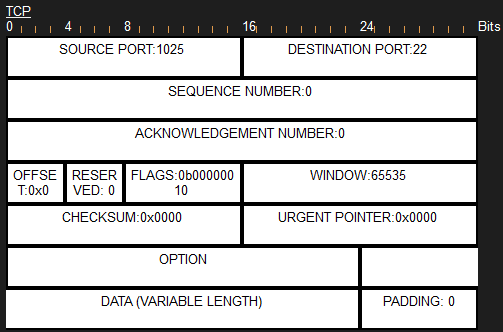
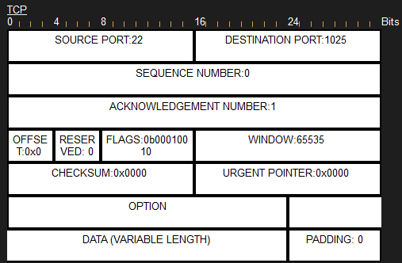
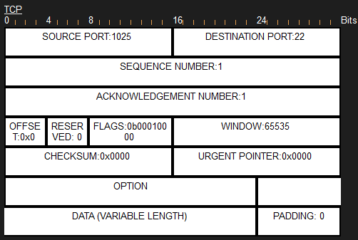

# Threat Simulations — TCP vs UDP Packet Capture

`../phase3-plan.md`'s "Packet Tracer Simulation Mode" section walks through capturing a TCP 3-way handshake (SSH)
and a connectionless UDP datagram (Syslog) side by side in Packet Tracer's Simulation Mode, to demonstrate the
CCNA 1.5 TCP-vs-UDP contrast concretely rather than just describing it. Real Wireshark can't see this traffic (it
never touches the host's real NIC), so Simulation Mode is the only way to capture it.

## TCP — the 3-way handshake

`PH-MNL-ACC# ssh -l asean.admin 10.10.110.1`, captured packet-by-packet in Simulation Mode. Packet Tracer shows
the raw TCP header rather than pre-decoded flag names (unlike Wireshark), so each capture below shows the actual
`FLAGS` field as a binary value — decoded in the caption. All three are from the same connection attempt
(consistent source port `1025` throughout), not stitched together from separate attempts.

   
  <code>1025 → 22</code>, <code>Seq=0, Ack=0</code>, <code>FLAGS=0b00000010</code> — SYN only, the opening packet

   
  <code>22 → 1025</code>, <code>Seq=0, Ack=1</code>, <code>FLAGS=0b00010010</code> — SYN + ACK both set, the server's reply

   
  <code>1025 → 22</code>, <code>Seq=1, Ack=1</code>, <code>FLAGS=0b00010000</code> — ACK only, connection established

## UDP — a single connectionless datagram

Still outstanding. Trigger: a port-security violation on an access port generating a Syslog message toward
`MY-KL-DMZ-SRV` (`10.10.40.10`, Syslog service enabled — see
[`../evidences/tftp-backup/`](../evidences/tftp-backup/) for how that server was added), captured the same way in
Simulation Mode. The point of contrast: a single
datagram, no SYN/ACK negotiation, no connection state — unlike the three packets above.
