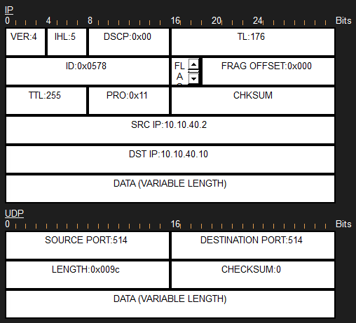

# Threat Simulations — TCP vs UDP Packet Capture

`../phase3-plan.md`'s "Packet Tracer Simulation Mode" section walks through capturing a TCP 3-way handshake (SSH)
and a connectionless UDP datagram (Syslog) side by side in Packet Tracer's Simulation Mode, to demonstrate the
CCNA 1.5 TCP-vs-UDP contrast concretely rather than just describing it. Real Wireshark can't see this traffic (it
never touches the host's real NIC), so Simulation Mode is the only way to capture it.

## TCP — the 3-way handshake

`PH-MNL-ACC# ssh -l asean.admin 10.10.110.1`, captured packet-by-packet in Simulation Mode. Packet Tracer shows
the raw TCP header rather than pre-decoded flag names (unlike Wireshark), so each capture below shows the actual
`FLAGS` field as a binary value — decoded in the caption. All three are from the same connection attempt
(consistent source port `1025` throughout), not stitched together from separate attempts.

   
  <code>1025 → 22</code>, <code>Seq=0, Ack=0</code>, <code>FLAGS=0b00000010</code> — SYN only, the opening packet

   
  <code>22 → 1025</code>, <code>Seq=0, Ack=1</code>, <code>FLAGS=0b00010010</code> — SYN + ACK both set, the server's reply

   
  <code>1025 → 22</code>, <code>Seq=1, Ack=1</code>, <code>FLAGS=0b00010000</code> — ACK only, connection established

## UDP — a single connectionless datagram

Triggered with a real port-security violation, not a synthetic example: `MY-KL-HQ-CORE`'s `Gi1/0/3` was
temporarily configured as a test access port (`switchport port-security maximum 1`, `violation restrict`), with
a hub and two PCs attached so a second, different MAC address would hit the port after the first was already
secured. The resulting violation generated a real Syslog message toward `MY-KL-DMZ-SRV` (`10.10.40.10`, Syslog
service enabled — see [`../evidences/tftp-backup/`](../evidences/tftp-backup/) for how that server was added),
captured the same way in Simulation Mode as the TCP handshake above. `Gi1/0/3` and the two temporary PCs were
removed afterward - this was a one-off trigger, not part of the permanent topology.

   
  <code>10.10.40.2 → 10.10.40.10</code>, <code>PRO=0x11 (UDP)</code>, <code>Destination Port: 514</code>
  (syslog) — a single datagram, no SYN/ACK fields anywhere in either header, no connection state at all

The contrast with the TCP capture above is the whole point: three packets and explicit flag negotiation just to
*open* a TCP connection, versus one UDP datagram that either arrives or doesn't - no handshake, no acknowledgment
built into the protocol itself.
