# Phase 4 — LocalStack Validation Screenshots

Evidence of a `terraform plan` → `apply` → verify → `destroy` cycle run against **LocalStack** (a local AWS
API emulator), not a real AWS account — see `../phase4-plan.md` for why this project never applies the Terraform
in `../terraform/` against real AWS. LocalStack still exercises the actual Terraform code and the AWS provider's
API calls, so this confirms the configuration is mechanically correct for the resources it actually covers — see
the disclosure below for exactly which ones that is.
(Converted from the original `screenshots.docx` so it renders directly on GitHub instead of requiring a download.)

**What was and wasn't actually applied:** LocalStack's free tier doesn't include the `elbv2`, `rds`, or `wafv2`
services (confirmed via real `terraform apply` attempts that failed with "the \<service\> service is not included
within your LocalStack license" — see the `PLATFORM LIMITATION` comments at the top of `alb.tf`, `rds.tf`, and
`waf.tf`). That means `aws_lb`, both listeners, the target group, the ASG/launch template (which depends on RDS's
generated secret ARN), `aws_db_instance`, and `aws_wafv2_web_acl` were only ever validated with `terraform plan` —
never `apply` — against LocalStack. `vpn-gateway.tf` has one more LocalStack gap on top of that: `aws_vpn_connection_route`
and both `aws_vpn_gateway_route_propagation` resources aren't implemented in LocalStack at all. The plan screenshot
below (68 resources) reflects the full configuration, including all of the above; the apply/verify/destroy
screenshots that follow only ever created and tore down the free-tier subset — VPC, subnets, security groups,
routing, KMS/S3 logging, IAM, and the VPN connection itself. No screenshot below shows `aws_lb`, `aws_db_instance`,
or `aws_wafv2_web_acl` in an applied state, because none of them ever were.

**Note on the RDS credentials screenshots below:** this apply cycle predates a later fix to `rds.tf`. At the time
of this run, the master password was generated via `random_password` and written into a manually-created
`aws_secretsmanager_secret` (`arehi-secops/rds/master-credentials`, visible in screenshots 2 and 3 below) — which
meant the plaintext password still landed in Terraform state despite Secrets Manager holding a copy. `rds.tf` now
uses `manage_master_user_password = true` instead, so RDS generates and owns the secret itself and Terraform never
sees the plaintext at all. The secret name/ARN shown below no longer matches current code for that reason; the
screenshots are kept as evidence that the Secrets Manager + RDS apply flow works end-to-end, not as a description
of the current credential-handling design.

That same refactor is also the full explanation for the plan count itself: the "68 to add" below was captured
against the pre-refactor code, which had three extra resources this commit removed — `random_password.db_master`,
`aws_secretsmanager_secret.db_credentials`, and `aws_secretsmanager_secret_version.db_credentials` — landing at 65.
A later fix added one more (`aws_security_group_rule.alb_ingress_http`, opening port 80 on the ALB's SG so the
`http_redirect` listener in `alb.tf` is actually reachable), so current code plans at exactly 66 resources
(verified by counting every `resource` block across all `.tf` files, expanding the ten that carry
`count = length(...)` over the 2-AZ variable lists) — 68 minus the 3 removed plus the 1 added, exactly.

## Plan & Apply

**`terraform plan`** — 68 resources to add, full output plan (VPC, subnets, ALB, RDS, WAF, KMS, VPN, Secrets Manager)
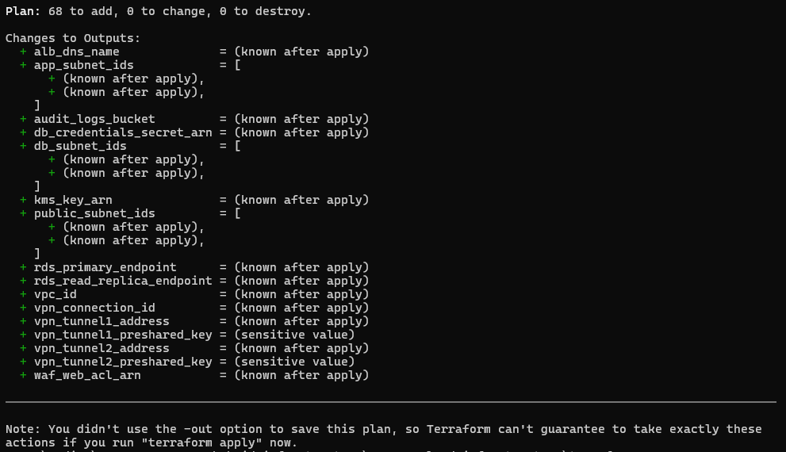

**`awslocal secretsmanager delete-secret`** — clearing a previous run's RDS master-credentials secret before re-applying
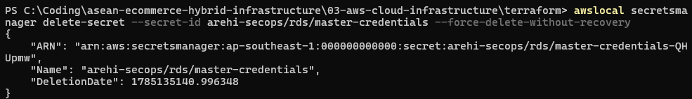

**`terraform apply` complete** — 5 added, 0 changed, 1 destroyed; outputs include subnet IDs, audit log bucket, KMS key ARN, VPN tunnel addresses
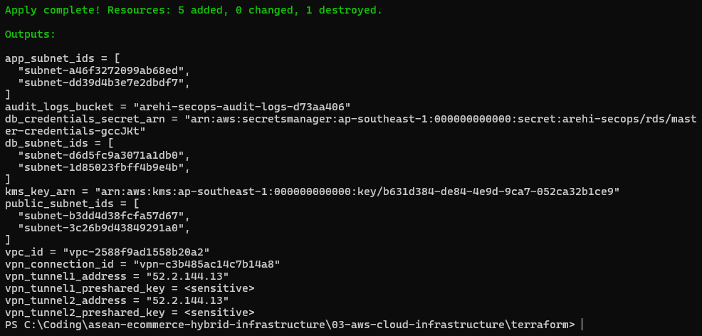

**Known LocalStack quirk in this output:** `vpn_tunnel1_address` and `vpn_tunnel2_address` above both show the
same IP (`52.2.144.13`). `outputs.tf` is correct — the two outputs reference `aws_vpn_connection.main.tunnel1_address`
and `.tunnel2_address`, genuinely distinct provider attributes — and the raw AWS-side tunnel config in the
`describe-vpn-connections` screenshot below confirms two real, different tunnel addresses (`52.2.144.13` and
`52.2.144.41`) exist. LocalStack's VPN emulation appears to populate both top-level output attributes from the
same underlying tunnel entry. Don't use `vpn_tunnel2_address` from a LocalStack apply as the real second-tunnel
peer address — use the `describe-vpn-connections` XML (or a real AWS apply) instead.

## Verifying Applied Resources

**`awslocal ec2 describe-subnets`** — all 6 subnets (public/app/db × 2 AZs) with correct AZ and CIDR
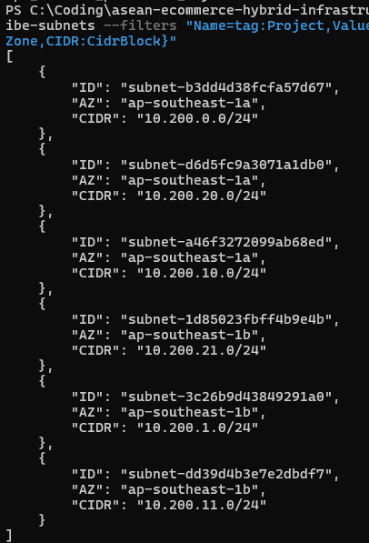

**`awslocal ec2 describe-security-groups`** — `arehi-secops-alb-sg`: HTTPS from internet in, app tier only out
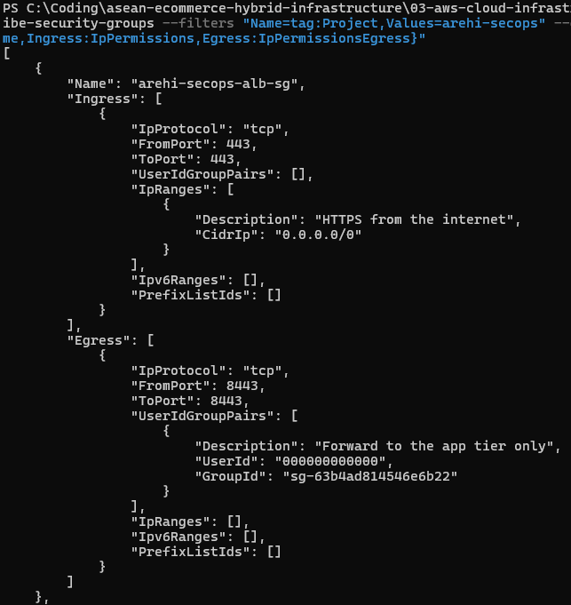

**`arehi-secops-app-sg`** — app traffic from ALB only in, NAT-routed internet + Postgres to DB tier out
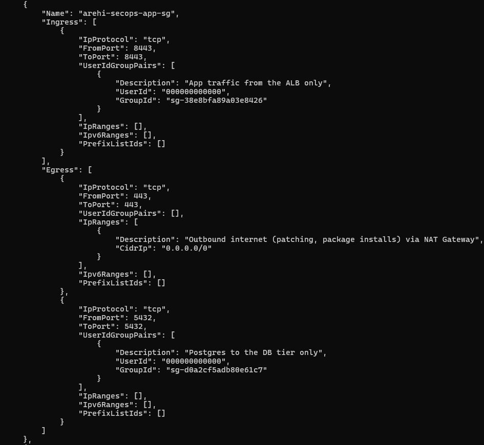

**`arehi-secops-db-sg`** — Postgres from app tier only in, no egress
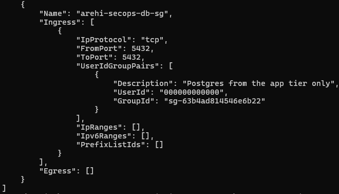

**`awslocal ec2 describe-vpn-connections`** — full Site-to-Site IPsec config, both tunnels, IKE/IPsec parameters
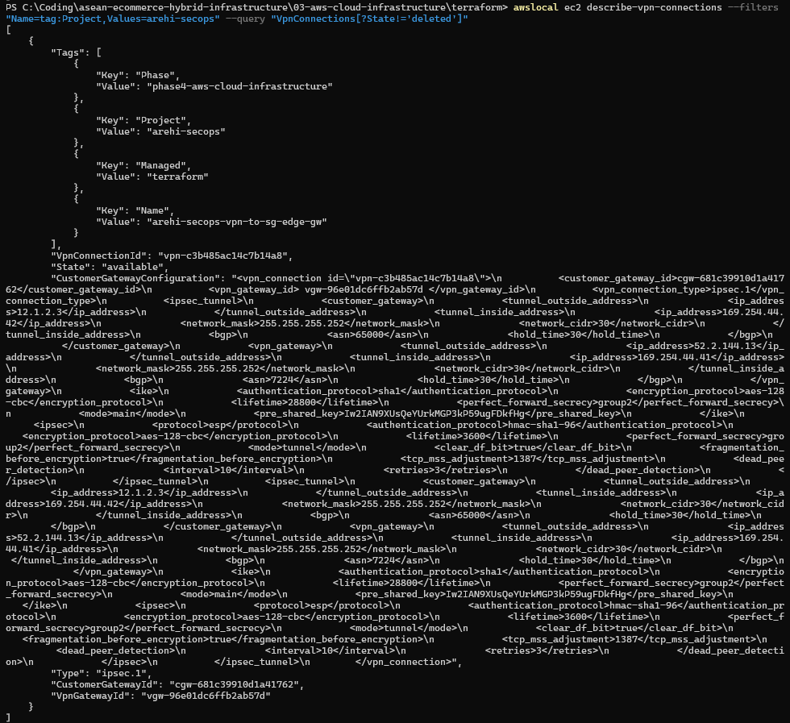

## LocalStack Dashboard

**Docker Desktop** — `localstack-main` container running
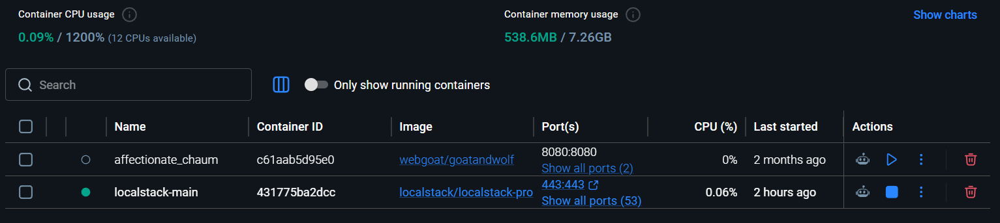

**Resource Browser — VPCs** — `arehi-secops` VPC (`10.200.0.0/16`) alongside the account default
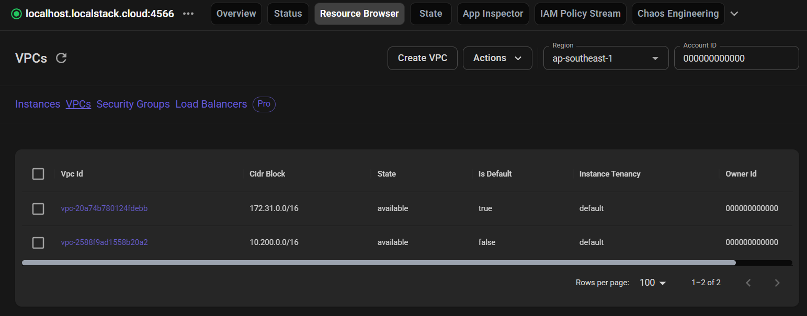

**Resource Browser — Security Groups** — all 3 tier security groups present with correct descriptions
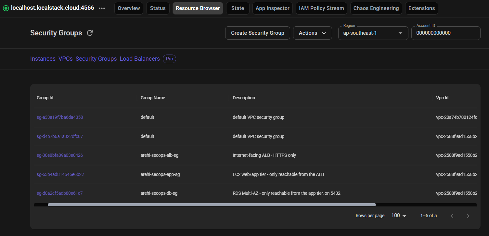

**Status — Services** — EC2, IAM, KMS, S3, Secrets Manager, STS all running
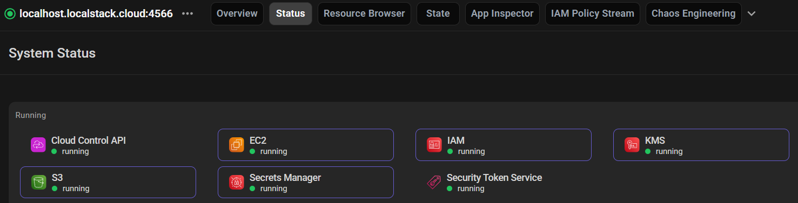

**Resource Browser — Subnets** — all 9 subnets across both AZs
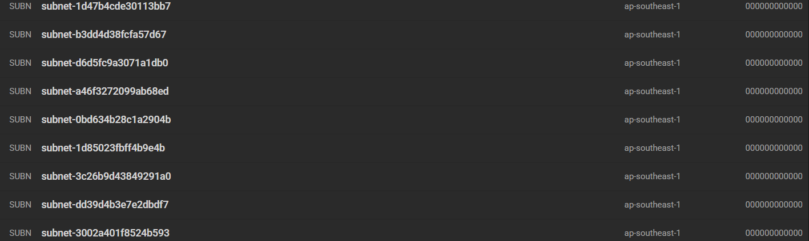

## Teardown

**`terraform destroy` complete** — 53 resources destroyed, clean teardown
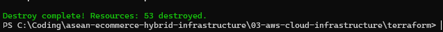
