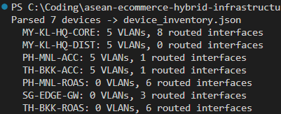
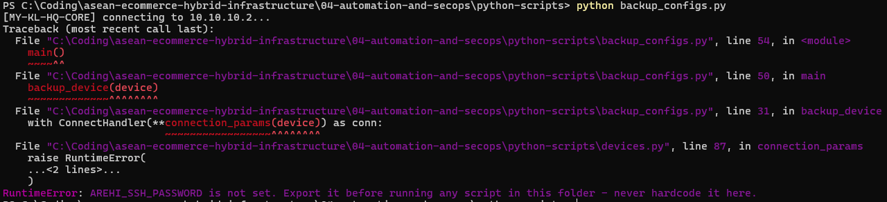
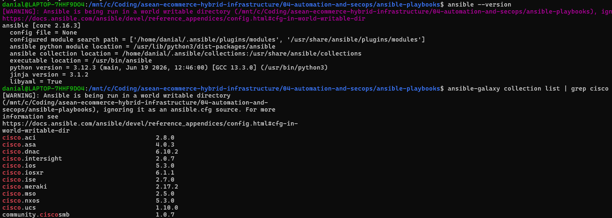
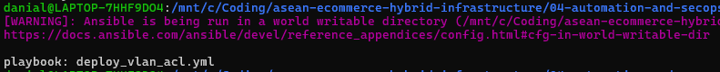
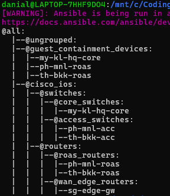
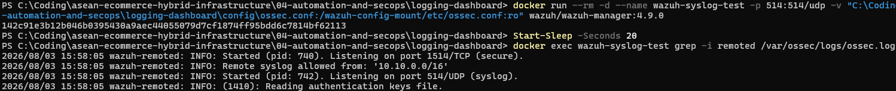
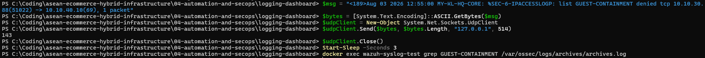
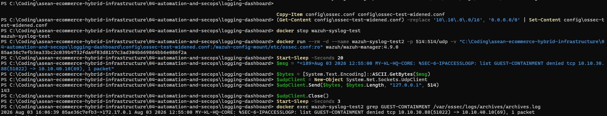

# Phase 5 — Verification Screenshots

Real terminal output, captured personally rather than only documented in the scripts/playbooks themselves — proof
the automation tooling in `../python-scripts/` and `../ansible-playbooks/` actually installs, parses real data,
and mechanically validates, not just that the code reads correctly. See [`../phase5-plan.md`](../phase5-plan.md)
for why none of this is ever run against a *live device* (no real-NIC bridge on this Packet Tracer build).

- [`python-scripts/`](python-scripts/) — `device_inventory.py`'s real run, plus Netmiko's credential guard firing
  for real on `backup_configs.py`
- [`ansible/`](ansible/) — Ansible + the `cisco.ios` collection, installed and exercised for real inside WSL Ubuntu
  (Ansible's control node doesn't run natively on Windows)
- [`wazuh-siem/`](wazuh-siem/) — the syslog-listener fix from
  `../logging-dashboard/evidence-syslog-listener-verified.txt`, reproduced firsthand end-to-end: listener up,
  scoped `allowed-ips` genuinely rejecting out-of-scope traffic, then genuine delivery confirmed with a widened
  test config

## Python scripts

**`device_inventory.py` — the only script in this phase that needs no live device connection.** Parses this
repo's own `.cfg` files directly and emits a structured JSON inventory. Real run, real output: **7** devices
parsed, one more than the 6-device SSH-managed inventory in `devices.py`/`phase5-plan.md` — the extra one is
`MY-KL-HQ-DIST`, correctly picked up because this script globs every `.cfg` file in `switching/`/`router-configs/`
rather than the narrower, deliberately-scoped SSH target list. `MY-KL-HQ-DIST` is a real device
(`01-regional-on-premises-network/switching/MY-KL-HQ-DIST.cfg`) that exists solely as `MY-KL-HQ-CORE`'s LACP
EtherChannel peer — out of scope for SSH automation and Phase 3 hardening (see
`../../01-regional-on-premises-network/topologies/asean-network-topology.md`), but still a legitimate `.cfg` file
this broader inventory script correctly surfaces. Not a bug — the two scripts have different, deliberately
different scopes.

   
  <code>python device_inventory.py</code> — parses 7 devices, VLAN/routed-interface counts per device, writes <code>device_inventory.json</code>

**`backup_configs.py` — Netmiko's credential guard, proven live.** `devices.py`'s `connection_params()` raises
`RuntimeError` if `AREHI_SSH_PASSWORD`/`AREHI_ENABLE_SECRET` aren't set in the environment, *before* Netmiko ever
opens a socket — the "never hardcode credentials" policy stated in the script's own comments actually enforced,
not just written. Run with neither variable set: the script fails immediately on the very first device, with a
full traceback pinning the failure to `devices.py`'s own guard, not a connection timeout or some unrelated error.

   
  <code>python backup_configs.py</code> (no env vars set) — <code>RuntimeError: AREHI_SSH_PASSWORD is not set...</code>, raised before any connection attempt

## Ansible

Ansible doesn't run natively on Windows, so every command below was run inside WSL Ubuntu, `cd`'d to
`04-automation-and-secops/ansible-playbooks/`.

**Environment proof** — `ansible --version` (core 2.16.3) and `ansible-galaxy collection list | grep cisco`
confirming `cisco.ios` 5.3.0 is genuinely installed, not just referenced in the playbook's `collections:` line.

   
  <code>ansible --version</code> / <code>ansible-galaxy collection list | grep cisco</code> — <code>cisco.ios 5.3.0</code> installed

**`ansible-playbook --syntax-check -i inventory.ini deploy_vlan_acl.yml`** — clean pass. The single line
`playbook: deploy_vlan_acl.yml` (after the world-writable-directory warning, unrelated to correctness) *is* what
a clean syntax-check looks like — Ansible only prints more than that when something's actually wrong.

   
  <code>ansible-playbook --syntax-check -i inventory.ini deploy_vlan_acl.yml</code> — clean, no errors

**`ansible-inventory -i inventory.ini --graph`** — confirms `inventory.ini` resolves exactly as designed: all 6
devices present, correctly nested (`switches` → `core_switches`/`access_switches`, `routers` →
`roas_routers`/`wan_edge_routers`), and `guest_containment_devices` correctly listing the 3 devices that actually
carry that ACL (`my-kl-hq-core`, `ph-mnl-roas`, `th-bkk-roas`).

   
  <code>ansible-inventory -i inventory.ini --graph</code> — all 6 devices, correct group hierarchy

## Wazuh SIEM — syslog listener fix, reproduced firsthand

`../logging-dashboard/evidence-syslog-listener-verified.txt` already documents this finding via a raw terminal
transcript. The three screenshots below are an independent, personal reproduction of the same standalone
`docker run` test — no full 3-service stack needed (no certs, no indexer), so this doesn't hit any of the Docker
Desktop/WSL2 issues that blocked the complete stack (see `../logging-dashboard/README.md`'s "Live Deployment
Attempt"). All three commands were run directly in PowerShell against Docker Desktop.

**1. The fix itself — both listeners come up, with the real committed `allowed-ips` scoping already loaded.**
Starting `wazuh/wazuh-manager:4.9.0` with `config/ossec.conf` mounted at `/wazuh-config-mount/etc/ossec.conf`
(Wazuh's own documented mount point — a direct bind mount to `/var/ossec/etc/ossec.conf` fails, see the
`docker-compose.yml` comments for why) produces two independent `wazuh-remoted` listeners, not just the stock
image's single secure/agent one.

   
  <code>docker exec ... grep -i remoted ossec.log</code> — <code>1514/TCP (secure)</code> and <code>514/UDP (syslog)</code> both started, <code>allowed from: '10.10.0.0/16'</code>

**2. The `allowed-ips=10.10.0.0/16` scoping genuinely rejects out-of-scope traffic.** A real test message, in this
project's actual `%SEC-6-IPACCESSLOGP` format, sent via UDP 514 from the host machine (arriving from outside
`10.10.0.0/16`). The `grep` for it in `archives.log` comes back empty — correctly rejected, not silently dropped
by some unrelated failure (the listener itself is proven working in the next step, isolating this as the scoping
rule specifically).

   
  Test message sent from host, then <code>grep GUEST-CONTAINMENT archives.log</code> — no match, correctly rejected by <code>allowed-ips</code>

**3. The listener itself genuinely delivers end-to-end**, isolating step 2's rejection as the scoping rule working
as intended rather than a broken listener. Same exact test message, resent against a temporary widened copy of the
config (`allowed-ips=0.0.0.0/0`) — this time it's genuinely captured in `archives.log`, sourced from `172.17.0.1`
(Docker's real bridge gateway address, not a loopback stand-in).

   
  Widened test config, same message resent — genuinely captured in <code>archives.log</code>, proving the listener itself works end-to-end

